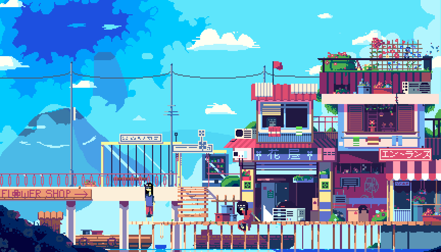

  

<h1 align="center">
  
</h1>

<h3 align="center">💻 Full Stack Developer | Tech Maker | Lifelong Learner</h3>

---

### About Me

- 🎓 **B.Tech Student** based in **India**
- 🧠 Currently deep-diving into the **MERN Stack** (MongoDB, Express, React, Node.js)
- ⚙️ Love building cool digital products, custom automation, and having fun along the way
- 👥 Adaptable collaborator who fits perfectly into development squads or excels on solo assignments
- 💬 Ask me about: **一期一会** *(Once-in-a-lifetime encounters)*
- 🖥️ Explore my chest room / portfolio at: [@AdrishikharC](http://adrishikharchowdhury.netlify.app/)
- 📫 Reach me at: **amiadrishikhar@gmail.com**

### 🛠️ Skills & Tools

  
  
  
  
  
  
  
  
  
  
  
  
  
  
  
  
  
  
  
  
  

---

### 🏆 GitHub Achievements

  

---

### 📊 GitHub Stats

  
  
   
  

---

### 🎮 Contribution Graph

<picture>
  <source media="(prefers-color-scheme: dark)" srcset="https://raw.githubusercontent.com/AdrishikharChowdhury/AdrishikharChowdhury/output/pacman-contribution-graph-dark.svg">
  <source media="(prefers-color-scheme: light)" srcset="https://raw.githubusercontent.com/AdrishikharChowdhury/AdrishikharChowdhury/output/pacman-contribution-graph.svg">
  
</picture>
